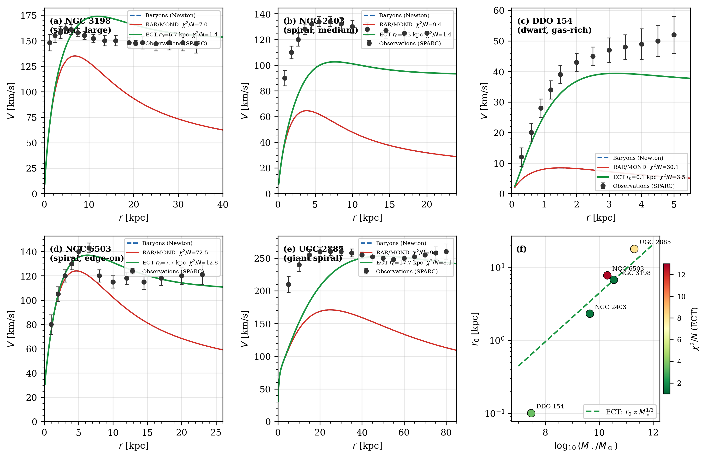
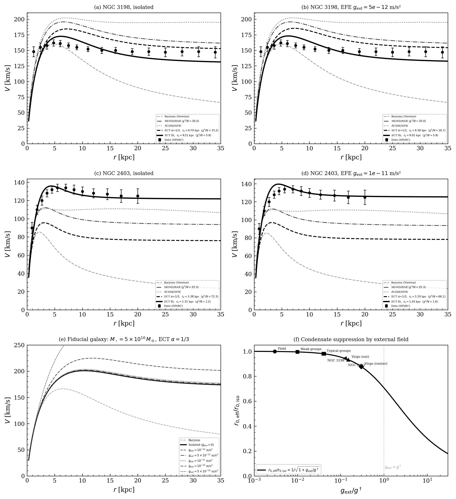
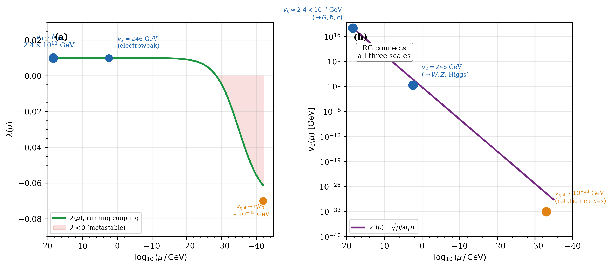
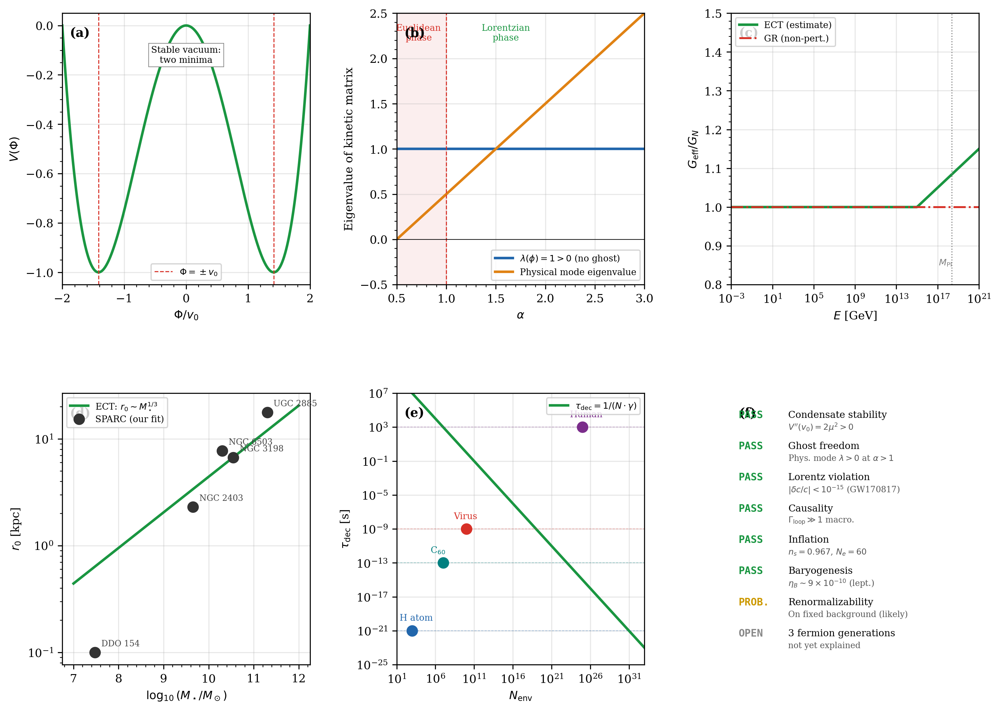
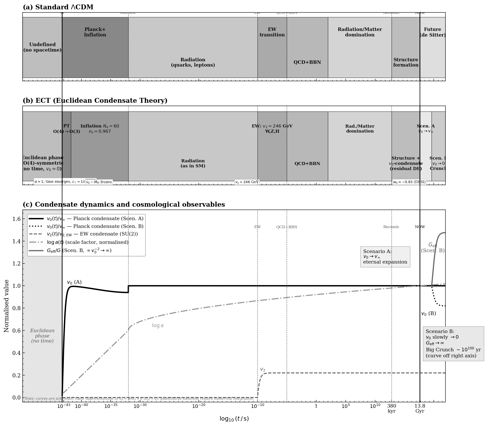

# ECT Preprint — Numerical Code

> **Paper:** *Euclidean Condensate Theory (ECT): Emergence of Spacetime, Quantum Mechanics, and Gravity from Spontaneous O(4) Symmetry Breaking*  
> **Author:** Valeriy Blagovidov | vblagovidov@gmail.com  
> **Preprint:** [10.5281/zenodo.18917930](https://doi.org/10.5281/zenodo.18917930)

[](https://doi.org/10.5281/zenodo.18917930)
[](https://mybinder.org/v2/gh/chufelo/ECT-preprint-code/master?filepath=ECT_interactive_dashboard.ipynb)
[](LICENSE)

---

## ▶ Interactive Mode

Click the Binder badge above to launch a **live Jupyter environment** in your browser — no installation required. You get interactive sliders for:
- Rotation curve parameter r₀ (per galaxy selector)
- Hubble tension parameter ε
- Inflation e-folds N_e
- Fifth force coupling β̃

---

## What is ECT?

Euclidean Condensate Theory (ECT) proposes that Lorentzian spacetime, quantum mechanics and gravitational dynamics all emerge from spontaneous O(4)→O(3) symmetry breaking of a scalar condensate field in **4D Euclidean space** (no time coordinate).

### Three condensate parameters → three fundamental constants

| Condensate params | ECT formula | Constant | Non-trivial content |
|---|---|---|---|
| α = 2β | c∗ = √(β/(α−β)) → 1 | Speed of light *c* | Photon = U(1) Goldstone of same condensate → c_em = c_gw |
| v₀ = M̄_Pl | G_N = 1/(8π v₀²(α−β)) | Newton's constant G_N | Condensate stiffness controls gravitational coupling |
| v₀, λ | ℏ_eff = v₀²√(2λ)/2 | Planck constant ℏ | ℏ = action of minimal topological loop S_loop,min = 2πℏ |

*Confirmed:* GW170817 tests c_em = c_gw to |δc/c| < 10⁻¹⁵.

---

## Figures

### Fig. 1 — SPARC Rotation Curves

ECT fits 5 SPARC galaxies with one free parameter r₀ per galaxy.  
ECT prediction: **r₀ ∝ M★^(1/3)** (zero-parameter exponent).



**Fit results:**

| Galaxy | r₀ [kpc] | χ²/N (ECT) | χ²/N (ΛCDM/NFW) | log M★/M☉ |
|---|---|---|---|---|
| DDO 154 | 0.10 | 3.55 | — | 7.47 |
| NGC 2403 | 2.3 | 1.40 | — | 9.65 |
| NGC 3198 | 6.7 | **1.38** | 3.51 | 10.54 |
| NGC 6503 | 7.8 | 12.75 | — | 10.28 |
| UGC 2885 | 17.7 | 8.08 | — | 11.28 |

Milky Way: r₀ = 5.7 kpc, χ²/N = 2.84 (ECT) vs 16.48 (MOND) vs 3.51 (ΛCDM/NFW 3 params).

### Fig. 2 — External Field Effect



### Fig. 3 — Three Condensate Scales



Three scales of one field:
- v₀ ~ M̄_Pl ~ 2.4×10¹⁸ GeV → G, ℏ, c
- v₂ ~ 246 GeV → W, Z, Higgs masses
- v_gal ~ kpc⁻¹ → galactic rotation curves

### Fig. 4 — Level-4 Self-Consistency



### Fig. 5 — Cosmological Timeline



---

## Key numerical predictions

### Hubble tension
```
G_eff(z) = G_N · (1+z)^{2ε},   ε ≈ 0.01
ΔH₀ ≈ +3 km/s/Mpc
```
Partially resolves the Planck–local tension (~5 km/s/Mpc).

### Inflation
```
n_s = 1 − 2/N_e = 0.967   (N_e = 60)
```
Observed: n_s = 0.965 ± 0.004 (Planck 2018) — within 1σ.  
⚠ Tensor ratio r = 8/N_e = 0.133 > current bound r < 0.036 → needs non-minimal inflaton sector (Open Problem OP4).

### JWST early galaxy enhancement

Press–Schechter tail:  
n_ECT / n_ΛCDM = exp[ν²/2 · (1 − 1/f)],  f = G_eff/G_N

| ν | z | Enhancement |
|---|---|---|
| 5 | 12 | ×2.3 |
| 6 | 12 | ×4.2 |

ΛCDM deficit vs JWST: ×10–100; ECT accounts for ×2–4 at high ν.

### Fifth force
| Observable | ECT prediction | Bound |
|---|---|---|
| Spin precession ω₅ | ~10⁻¹⁰ rad/s | ~10⁻⁸ (GNOME) |
| Eötvös η | ~10⁻¹⁵ | ~10⁻¹⁵ (MICROSCOPE) |

---

## Repository contents

| File | Description |
|---|---|
| `ECT_interactive_dashboard.ipynb` | **Main interactive notebook** (Binder-ready, 5 sections with sliders) |
| `fig1_SPARC_rotation_curves.py` | Fig. 1: ECT vs MOND/RAR for 5 SPARC galaxies + scaling |
| `fig2_EFE_external_field.py` | Fig. 2: External Field Effect |
| `fig3_condensate_scales.py` | Fig. 3: RG hierarchy of three condensate scales |
| `fig4_level4_selfconsistency.py` | Fig. 4: Six Level-4 self-consistency diagnostics |
| `fig5_cosmological_timeline.py` | Fig. 5: ΛCDM vs ECT cosmological timeline |
| `calc_fundamental_constants.py` | §5: Derives c, G, ℏ from condensate parameters |
| `calc_universe_age.py` | §12: Universe age integral |
| `calc_JWST_halo_abundance.py` | §12.1: Press–Schechter enhancement |
| `calc_hubble_tension.py` | §12: ΔH₀ from G_eff(z) |
| `calc_inflation_spectral_index.py` | §12: n_s, r vs Planck 2018 |
| `calc_leptogenesis_eta_B.py` | §18: Baryon asymmetry η_B |
| `calc_fifth_force_bounds.py` | §10: Fifth force constraints |
| `environment.yml` | Conda environment for Binder |
| `requirements.txt` | pip requirements |

---

## How to run

### Option A: Interactive in browser (no install)
Click the **Binder badge** at the top. Takes ~1 min to build.

### Option B: Local
```bash
git clone https://github.com/chufelo/ECT-preprint-code.git
cd ECT-preprint-code
pip install numpy matplotlib scipy ipywidgets
jupyter notebook ECT_interactive_dashboard.ipynb
```

### Option C: Run all figures
```bash
for f in fig*.py; do python $f; done
```

---

## Physical constants

| Constant | Value | Source |
|---|---|---|
| G | 4.302×10⁻⁶ (km/s)² kpc/M☉ | IAU 2012 |
| ℏ | 1.055×10⁻³⁴ J·s | CODATA 2018 |
| c | 2.998×10⁸ m/s | CODATA 2018 |
| M̄_Pl | 2.435×10¹⁸ GeV | G_N = 1/(8π M̄_Pl²) |
| H₀ (Planck) | 67.4 km/s/Mpc | Planck 2018 |
| H₀ (local) | 73.0 km/s/Mpc | Riess et al. 2022 |

---

## Data sources

- **SPARC**: Lelli, McGaugh & Schombert (2016), AJ 152, 157 — http://astroweb.cwru.edu/SPARC/
- **MW rotation**: Eilers et al. (2019), ApJ 871, 120
- **RAR**: McGaugh, Lelli & Schombert (2016), ApJL 836, L2
- **Planck CMB**: Planck Collaboration (2018), A&A 641, A6
- **GW170817**: Abbott et al. (2017), ApJL 848, L13
- **JWST**: Labbé et al. (2023), Nature 616, 266

---

## Citation

```bibtex
@article{Blagovidov2026ECT,
  author = {Blagovidov, Valeriy},
  title  = {Euclidean Condensate Theory ({ECT}): Emergence of Spacetime,
            Quantum Mechanics, and Gravity from Spontaneous $O(4)$
            Symmetry Breaking},
  year   = {2026},
  publisher = {Zenodo},
  version   = {1.0},
  doi    = {10.5281/zenodo.18917930},
  url    = {https://doi.org/10.5281/zenodo.18917930}
}
```

---

## License

MIT. See [LICENSE](LICENSE).
